<!-- Replace the link below with your live Portfolio URL if it is different -->

## ✦ Hello, I'm Sanjev

I'm a **UI/UX designer** who obsesses over how interfaces *feel*: depth, light, motion, and the calm of ****. I design clean systems first, then build prototypes that actually run.

| | What I do | In practice |
|:--|:--|:--|
| 🎨 | **UI design** | Clean layouts, glass and depth, strong hierarchy |
| 🧭 | **UX flows** | Research, user journeys, wireframes that make sense |
| ✨ | **Motion** | Micro-interactions that explain, not distract |
| 🧩 | **Design systems** | Tokens, components, consistent patterns |
| ⚙️ | **Build & ship** | Python, TypeScript, CI/CD, data and fintech projects |

## ◐ How I design

| Principle | What it means |
|:--|:--|
| **Clarity first** | If a screen needs explaining, it isn't finished |
| **Depth with purpose** | Light, blur and layers guide the eye; they never decorate |
| **Motion that explains** | Movement shows what changed and what to do next |
| **Accessible by default** | Strong contrast, comfortable tap targets, readable type |

## ⚙️ Under the hood

| 🔹 Module | Readout |
|:--|:--|
| **Primary stack** | Python · TypeScript |
| **Current mission** | Hackathon prototypes with real backend + frontend |
| **Learning queue** | Explainable ML · CI/CD automation · quant risk models |

## 🗂️ Case studies

| Project | What it is | Stack |
|:--|:--|:--|
| **[`_FINSHIELD_`](https://github.com/Sanjev300405/_FINSHIELD_)** | ONE LINE: what it detects or protects | `Python` |
| **[`customer-churn-dashboard`](https://github.com/Sanjev300405/customer-churn-dashboard)** | Shows which customers are likely to leave, and why | `Python` |
| **[`cicdpipeline`](https://github.com/Sanjev300405/cicdpipeline)** | Automated build, test and deploy pipeline | `TypeScript` |

## 🧰 Toolkit

<!-- Edit this list to the tools you really use: figma, ps, ai, xd, framer, html, css, js, ts, react, python, git, github -->

## NATURE

## ANALYSE

## 📫 Let's make something

