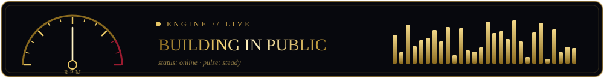

<!-- CYBER RED · ANIMATED. Needs the /assets folder (banner.svg, divider.svg, heartbeat.svg) in this same repo. -->



<div align="center">

[](https://github.com/Sanjev300405)




</div>


## `>_ whoami`

```bash
$ whoami
sanjev

$ cat profile.txt
role      : student developer / builder
focus     : data, fintech analytics, CI/CD, geospatial AI
mindset   : ship a working version first, polish later
status    : [ ONLINE ]  building hackathon prototypes
```


## ⚡ System status

| 🔴 Module | Readout |
|:--|:--|
| **Primary stack** | Python · TypeScript |
| **Current mission** | Hackathon prototypes with real backend + frontend |
| **Learning queue** | Explainable ML · CI/CD automation · quant risk models |

## 🧩 Active modules

| Module | Payload | Stack |
|:--|:--|:--|
| **[`_FINSHIELD_`](https://github.com/Sanjev300405/_FINSHIELD_)** | ONE LINE: what it detects or protects | `Python` |
| **[`customer-churn-dashboard`](https://github.com/Sanjev300405/customer-churn-dashboard)** | Shows which customers are likely to leave, and why | `Python` |
| **[`cicdpipeline`](https://github.com/Sanjev300405/cicdpipeline)** | Automated build, test and deploy pipeline | `TypeScript` |


## 🛠️ Arsenal

<div align="center">


</div>


## 📡 Telemetry

<div align="center">


</div>


## 🐍 Contribution feed

<div align="center">

<!-- Needs the snake.yml workflow to have run once. Until then this image is broken. -->


</div>


## 📫 Establish connection

<div align="center">

[](https://www.linkedin.com/in/sanjev-k-6b613627b/)
[](mailto:sanjevk2005@gmail.com)
[](https://github.com/Sanjev300405)

</div>


