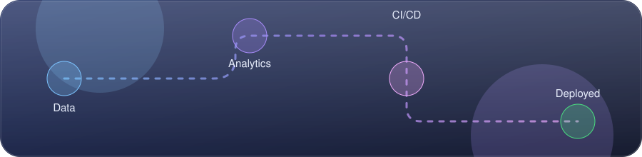

<Signaldiv align="center">

[](https://github.com/Sanjev300405)

[](https://sanjev300405.github.io/Sanjev300405/index.html)




</div>

## Profile

```
$ whoami
sanjev

$ cat profile.txt
role     : student developer / builder
focus    : data, fintech analytics, CI/CD, geospatial AI
mindset  : ship a working version first, polish later
status   : [ ONLINE ] building hackathon prototypes
```

## Projects

| Project | What it does | Stack |
| --- | --- | --- |
| [`_FINSHIELD_`](https://github.com/Sanjev300405/_FINSHIELD_) | ONE LINE: what it detects or protects | `Python` |
| [`customer-churn-dashboard`](https://github.com/Sanjev300405/customer-churn-dashboard) | Shows which customers are likely to leave, and why | `Python` |
| [`cicdpipeline`](https://github.com/Sanjev300405/cicdpipeline) | Automated build, test and deploy pipeline | `TypeScript` |

## Toolchain


## Stats

<div align="center">


</div>

## Contact

[](https://www.linkedin.com/in/sanjev-k-6b613627b/)
[](mailto:sanjevk2005@gmail.com)
